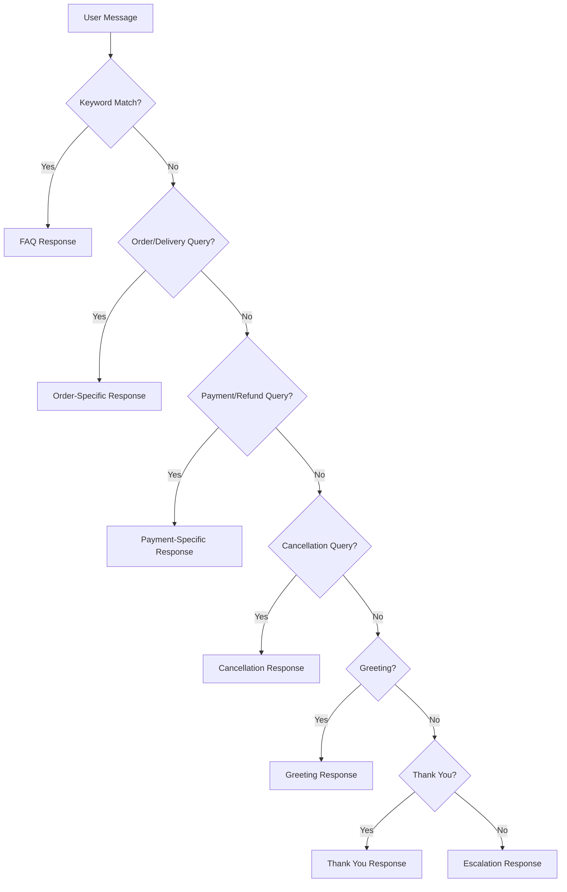

# AI Prompt Documentation

This document describes the prompts and logic used in our Unthinkable Support Chatbot.

## Overview

Our AI system uses a combination of:
1. FAQ matching based on keyword detection
2. Predefined response templates
3. Escalation protocols for complex queries
4. Contextual awareness of customer data

## Response Generation Logic

The AI follows this decision tree to generate responses:



## Prompt Templates

### FAQ Responses

When a user's message matches an FAQ, the system returns the predefined answer:

```
FAQ: "What are your delivery hours?"
Response: "We deliver from 9 AM to 8 PM, Monday through Sunday."

FAQ: "How can I track my order?"
Response: "You can track your order status in the 'My Orders' section of our app or website."

FAQ: "What payment methods do you accept?"
Response: "We accept all major credit cards, debit cards, UPI, and digital wallets like PayPal."

FAQ: "How do I cancel my order?"
Response: "You can cancel your order from the 'My Orders' section before it's out for delivery."
```

### Order-Specific Responses

For order or delivery related queries:

```
Template: "I can help you with order and delivery related queries. Could you please provide your order ID?"
```

### Payment-Specific Responses

For payment or refund related queries:

```
Template: "For payment and refund related queries, I recommend checking your transaction history or contacting our billing department."
```

### Cancellation Responses

For cancellation requests:

```
Template: "To cancel an order, please visit the 'My Orders' section in our app or website."
```

### Greeting Responses

For greetings:

```
Template: "Hello! How can I assist you today?"
```

### Thank You Responses

For expressions of gratitude:

```
Template: "You're welcome! Is there anything else I can help you with?"
```

### Escalation Responses

For queries that cannot be resolved:

```
Template: "I'm unable to address your query at the moment. Let me connect you with a human agent who can assist you better."
```

## Contextual Prompts

The AI uses customer context to personalize responses:

### Customer Data Integration

When a chat session is initiated, the system loads the customer's data:
- Name
- Order history
- Recent purchases

This information is used to personalize responses:

```
Template: "Hello {customerName}! I see you've ordered {recentOrderItems} recently. How can I help you with that order?"
```

### Order-Specific Context

When discussing a specific order:

```
Template: "Regarding your order {orderId} placed on {orderDate}, I can see that it included {orderItems}. What would you like to know about this order?"
```

## Improvement Opportunities

### LLM Integration

In a production environment, these simple templates would be replaced with more sophisticated prompts for an LLM:

```
System Prompt:
"You are a customer support agent for Unthinkable. 
You are helpful, friendly, and knowledgeable about our services, ordering process, 
delivery policies, and customer service procedures. Always maintain a professional 
and courteous tone. If you cannot resolve a customer's issue, escalate appropriately."

User Prompt:
"Customer: {userMessage}
Customer Name: {customerName}
Recent Orders: {recentOrders}
Current Context: {conversationHistory}
Please provide a helpful response."
```

### Sentiment Analysis

Future enhancements could include sentiment analysis:

```
If customer sentiment is negative:
"Template: I understand you're frustrated, and I apologize for the inconvenience. 
Let me see how I can help resolve this issue for you."

If customer sentiment is positive:
"Template: I'm glad to hear you're enjoying our service! Is there anything 
else I can help you with today?"
```

### Multi-turn Conversation

For complex issues requiring multiple exchanges:

```
Template: "Let me gather some information to help you better. 
Could you please provide your order number and a brief description of the issue?"
```

## Testing Prompts

### Positive Test Cases

1. "What are your delivery hours?" → FAQ response
2. "I want to track my order" → Order-specific response
3. "How can I pay for my order?" → Payment-specific response
4. "I need to cancel order ORD-001" → Cancellation response
5. "Hello!" → Greeting response
6. "Thank you" → Thank you response

### Negative Test Cases

1. "I have a complex billing issue" → Escalation response
2. "This food was terrible" → Escalation response (negative sentiment)
3. "Can you predict the future?" → Escalation response (out of scope)

## Prompt Engineering Best Practices

1. **Clarity**: Responses should be clear and concise
2. **Consistency**: Tone and terminology should be consistent
3. **Context Awareness**: Use customer data to personalize responses
4. **Escalation Paths**: Always provide a path to human support
5. **Empathy**: Show understanding and concern for customer issues
6. **Accuracy**: Ensure factual information is correct
7. **Actionability**: Provide clear next steps when possible

This prompt system provides a foundation that can be enhanced with more sophisticated NLP and LLM integration in a production environment.