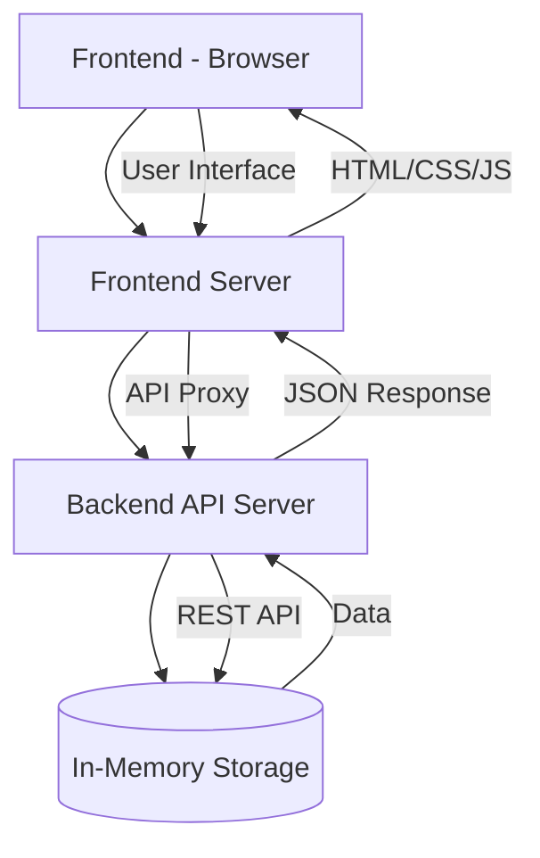

# Application Architecture

## Components

### Frontend
- **Technologies**: HTML, CSS, JavaScript
- **Features**:
  - Customer profile cards display
  - Chat interface
  - Real-time messaging
  - Responsive design

### Frontend Server
- **Technologies**: Node.js, Express
- **Features**:
  - Static file serving
  - API proxy to backend
  - Route handling

### Backend API Server
- **Technologies**: Node.js, Express
- **Features**:
  - RESTful API endpoints
  - Customer data management
  - Session handling
  - Message processing
  - FAQ matching

### Data Storage
- **Technologies**: In-memory JavaScript objects
- **Features**:
  - Customer profiles
  - Order history
  - Chat sessions
  - FAQ database